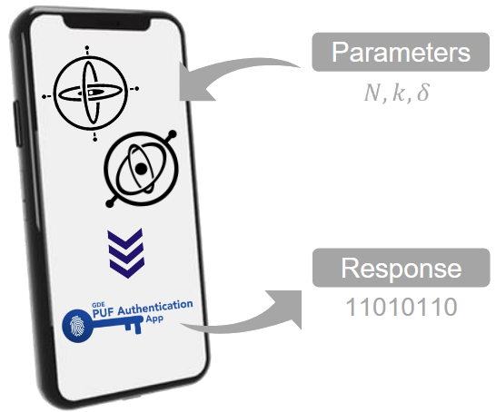

# Proposal of a new PUF based on sensors for the identification of IoT smart mobile devices

Authors: Raúl Aparicio-Téllez (r.aparicio@unizar.es), Jorge Fernandez-Aragon (jorgefusti96@gmail.com), Abel Naya-Forcano (abeln@unizar.es) and Guillermo Diez-Señorans (gds@unizar.es)

Supervisors: Miguel Garcia-Bosque (mgbosque@unizar.es), Santiago Celma (scelma@unizar.es)

Group of Electronic Design (GDE), I3A, University of Zaragoza, Pedro Cerbuna 12, Zaragoza, Spain

---

## Links

## [Full paper ](https://github.com/abeln94/GDE-puf/blob/main/2023_CSAW_Acelerometros.pdf)         [Conference poster ](https://github.com/abeln94/GDE-puf/blob/main/Poster_CSAW_23.pdf)         [Play store app ](https://play.google.com/store/apps/details?id=es.unizar.gde.puf)

---

## Abstract

The increasing development of the Internet of Things (IoT) has suppose
the exchange of large amounts of information among devices, that must be protected
against cyberattacks. In this context, Physically Unclonable Functions (PUFs) arise as
an optimal solution to this problem, as they exploit the stochastic variations occurring
during the manufacturing process of the devices to generate a binary sequence that
uniquely identifies each device. In this work, we propose a new PUF based on the signal measured by several sensors such as the accelerometer or the gyroscope of different
smart mobile devices. This new proposal, designed exclusively for the participation in
this competition, is especially interesting since using the sensors of the mobile devices
does not require the implementation of additional electronic circuits, making the proposed PUF already integrated into an IoT system. The results obtained show that this
PUF can be used for identification and authentication purposes, demonstrating that our
solution can efficiently protect an IoT system.

## Keywords
Authentication, hardware security, identification, internet of things, physically unclonable function.

---

## Key ideas

Own-developed app to measure and obtain the binary key.

- Justification
    - Sensors of smart mobile devices provide an inherent non-zero
acceleration, angular velocity and noise level when stationary.

- Proposal
    - Use the non-zero measured parameters obtained to generate a unique fingerprint.

- PUF
    - Results provide a valid identification and authentication system. Already integrated in IoT system.

